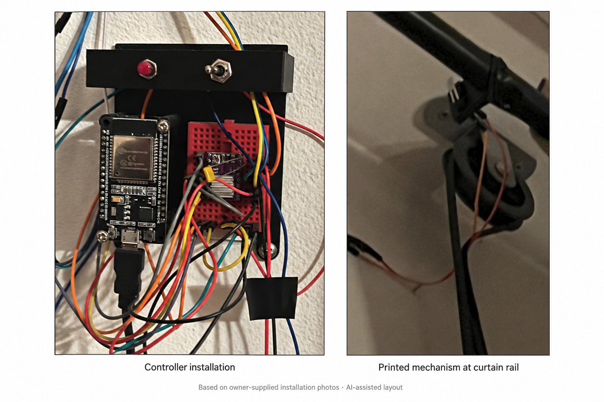
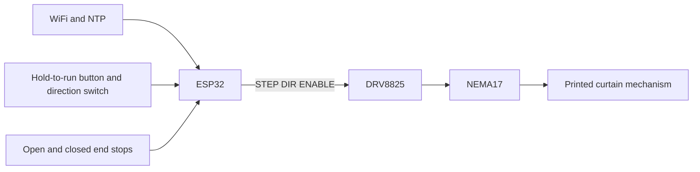

# Sensory Alarm System

An ESP32 alarm that opens bedroom curtains with a stepper motor and a printed mechanism. A physical direction switch and hold-to-run button provide manual control; end stops and a five-second timeout bound each movement.



*Based on the owner's installation screenshots; [AI-assisted layout](docs/images/installation-layout.txt). The controller close-up leads, with the curtain mechanism alongside it.*

[Wiring](docs/Electrical.md) · [Printable parts](docs/Mechanical.md) · [Hardware checks](docs/Validation.md) · [Public readiness](docs/public_readiness_report.md)

## The build

Simona Todorova and Alexander Stoilov built the original version over Christmas weekend in December 2024, using an Arduino Mega2560 for motor control, an ESP32 for WiFi/time, SolidWorks CAD, and a physical curtain installation.

Alexander's subsequent work migrated the firmware to PlatformIO and simplified the electronics to a single ESP32. The October 2026 public-readiness pass added hold-to-run control, cooperative motor stepping, latched faults, reliable offline manual control, daylight-saving rules, and date-based alarm tracking. Contributor names and original commit dates remain; personal email and CAD source-path metadata have been removed from local historical revisions.

**Status:** personal hardware prototype. The earlier build was reported working; the revised firmware has automated behavior checks and a compile check, but still needs validation on the assembled hardware. The supplied installation photographs document the earlier assembly. An operating video is outside this release scope; the CAD animation below illustrates the original printable designs.

## Wiring


*Regenerated logical wiring illustration. Follow the [connection tables](docs/Electrical.md) and check your actual board labels before assembly.*

## Printed mechanism

These are previews embedded in the original CAD exports, rather than photographs of the installed build. Download the models and read the [printing and assembly notes](docs/Mechanical.md).

| Curtain puller | Controller and driver holder | Button holder |
| --- | --- | --- |
|  |  |  |
| [CurtainPuller_v2.3mf](mechanical%20parts/CurtainPuller_v2.3mf) | [ESP32-DRV-BTNs_Holder.3mf](mechanical%20parts/ESP32-DRV-BTNs_Holder.3mf) | [Button_holders.3MF](mechanical%20parts/Button_holders.3MF) |


[Download the six-second CAD video](docs/images/cad-turntable.mp4). These are rotating views of the actual 3MF geometry, not footage of curtain operation. [Regenerate the render](tools/render_cad.py).

## How it works



- **Manual:** select direction, then hold the run button. Release stops immediately on the next loop. Changing direction stops the current run; release and press again to move in the new direction. Manual control works without WiFi or valid time.
- **Automatic:** open at **06:30 Bulgarian local time**, with winter/summer timezone rules. The alarm can be evaluated throughout that minute; there is no late catch-up. A button press interrupts automatic movement, and manual activity during the scheduled minute suppresses that day's automatic run.
- **Daily tracking:** the automatic attempt date is saved in ESP32 NVS before movement, preventing a repeat after restart. An already-open curtain or manual/fault override consumes the day too; skipped dates encountered during travel are saved after movement stops. A power loss before that deferred save can lose the skipped-date record.
- **Motor:** STEP pulses are generated cooperatively, with 500µs minimum high/low intervals. No catch-up pulse bursts are emitted. WiFi reconnect requests and flash writes are deferred during travel.
- **Faults:** a five-second timeout or both limit switches active disables the driver and latches a fault until restart. Inspect the wiring and mechanism before restarting. A button held during boot must first be released.

The alarm time, GPIO assignments, timezone rules, and motor settings live in [config.h](src/esp32/config.h). Persisted attempt dates are independent of the compiled alarm setting; reflashing or rebooting is not a routine way to re-run today's alarm.

## Firmware structure

| File | Responsibility |
| --- | --- |
| [main.cpp](src/esp32/main.cpp) | Startup and cooperative loop |
| [config.h](src/esp32/config.h) | Pins, schedule, timezone and timing |
| [curtain_controller.cpp](src/esp32/curtain_controller.cpp) | State-aware command guards, limit checks, faults and step edges |
| [manual_input.cpp](src/esp32/manual_input.cpp) | Debounced hold-to-run input and physical override |
| [alarm_scheduler.cpp](src/esp32/alarm_scheduler.cpp) | Daily schedule and persistent attempt tracking |
| [network_clock.cpp](src/esp32/network_clock.cpp) | Idle WiFi recovery and SNTP startup |

The controller reports motion, limit-derived position, command source and fault cause separately. With neither end stop active, position is **unknown**. Busy requests cannot reverse an active movement; stop preserves latched faults. Manual input and the alarm share the same guarded command API. See the [state transitions](docs/improvements_brief.md#controller-state).

## Build and flash

Requires an ESP32 DevKit compatible with PlatformIO's `esp32dev` definition, a data-capable USB cable, and [PlatformIO Core or its VS Code extension](https://docs.platformio.org/en/latest/core/installation/index.html). The platform and Arduino framework revision are pinned in [platformio.ini](platformio.ini).

Copy the credential template, then edit only the local copy:

```bash
cp include/secrets.example.h include/secrets.h
```

`include/secrets.h` is ignored by Git. Keep personal credentials out of commits, screenshots, and downloadable firmware; compiled firmware contains the supplied credentials.

Compile, identify the serial port, then flash and monitor:

```bash
pio run --environment esp32
pio device list
pio run --environment esp32 --target upload
pio device monitor
```

The serial monitor uses **115200 baud**. If upload cannot connect, hold the board's BOOT button while connecting. Initially disconnect the motor PSU and verify logic before introducing motor movement. Follow the [wiring reference](docs/Electrical.md) and [commissioning checklist](docs/Validation.md) before running the assembled mechanism.

## Verification

Run the firmware behavior tests with Python 3 and a C++17 compiler on Linux, macOS or WSL:

```bash
python3 test/run_host_tests.py
```

The tests execute the actual firmware with fake GPIO, WiFi, flash storage, and clocks. They cover offline control, release-to-stop, debounce, alarm/manual interaction, timeout faults, end stops, persistent dates, timer rollover, and seasonal timezone behavior. They do not establish motor timing or electrical safety on the real board. [GitHub Actions](.github/workflows/checks.yml) runs the behavior tests and compiles with placeholder credentials; no firmware artifacts are uploaded.

Record physical results in [Validation.md](docs/Validation.md), including the actual carrier/motor model, current limit, curtain travel time, and end-stop behavior.

## Limitations and future work

End stops are polled by firmware and are not an independent hardware emergency stop. An unplugged switch reads inactive with the current pull-up wiring; there is no obstruction sensing. Driver disable at boot depends on software until the ESP32 configures the GPIO. Mechanical loads and restart behavior need physical validation.

Software-generated step timing can vary with ESP32 background work. Acceleration, editable/persistent alarm settings, a web interface, and OTA updates are not implemented. The [improvements brief](docs/improvements_brief.md) describes future extensions. The firmware is split into focused modules, with [main.cpp](src/esp32/main.cpp) coordinating input, movement, network recovery and scheduling.

The compile-tested PlatformIO baseline uses Arduino 2.0.17 / ESP-IDF 4.4.7. ESP-IDF 4.4 is [past vendor support](https://github.com/espressif/esp-idf/releases/tag/v4.4.8); a supported SDK migration remains necessary before treating this legacy prototype as maintained network-connected firmware.

## License

[MIT](LICENSE). See the build background above for original contributor credit.
