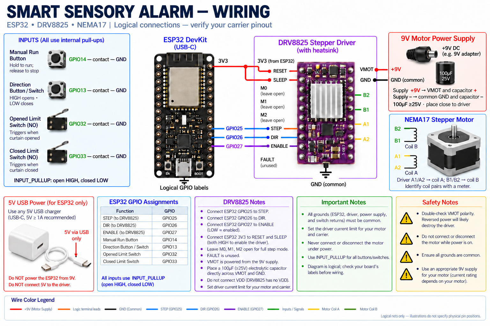

# Electrical wiring reference

Logical connections for the ESP32 curtain prototype. The restored illustration retains the original visual style and corrects the earlier wiring errors. It was regenerated with AI and checked against the connection tables and manufacturer references below; it has not been validated on the physical assembly. Verify the exact ESP32 board and DRV8825 carrier against their manufacturer diagrams before assembly: the original carrier revision has not yet been recorded.

The illustration shows logical nets. The component artwork does not specify physical GPIO or carrier pin positions. Repeated GND symbols name one common ground; matching motor tags and input/power equations define the remaining connections. Use the labels printed on the actual board and its schematic. The tables below are the authoritative project mapping; an [editable overview](images/connections.svg) and [image generation notes](images/wiring-generation.txt) are also available.

## Components and power

| Component | Current design | Detail still needed |
| --- | --- | --- |
| Controller | ESP32 DevKit, `esp32dev` build target | Exact board/module and revision |
| Motor driver | DRV8825 carrier | Manufacturer, revision and sense-resistor values |
| Motor | Bipolar NEMA17 stepper | Part number, rated coil current and verified coil pairs |
| Controller supply | 5V through USB | USB supply/data cable suited to the board |
| Motor supply | Separate 9V DC supply; previous design recommended at least 2A | Actual supply rating and voltage under load |
| Local decoupling | 100µF electrolytic, at least 25V, near VMOT/GND | Installation and polarity confirmed on hardware |

The DRV8825 operating supply range is 8.2–45V. The proposed 9V supply is near the lower boundary, so verify that its voltage remains suitable under load. Use a supply sized for the actual motor and configured current limit, rather than treating NEMA17's frame size as an electrical specification. See the [TI datasheet](https://www.ti.com/lit/ds/symlink/drv8825.pdf) and [Pololu carrier reference](https://www.pololu.com/product/2133/).

Power the ESP32 through USB. Connect motor PSU positive to **VMOT** and negative to **driver GND**. Connect **ESP32 GND, driver GND, motor PSU negative and all switch grounds together**. Neither USB 5V nor ESP32 3V3 powers VMOT.

Place the bulk capacitor directly across VMOT and GND near the carrier, with its positive lead to VMOT. Pololu documents destructive LC supply spikes and recommends at least 47µF local bulk capacitance for its carrier; the original design specifies 100µF. A small onboard ceramic capacitor alone does not replace that bulk capacitor.

## Controller signals

These assignments match [config.h](../src/esp32/config.h):

| ESP32 | DRV8825 | Function |
| --- | --- | --- |
| GPIO25 | STEP | Step pulses |
| GPIO26 | DIR | HIGH opens; LOW closes, subject to motor orientation |
| GPIO27 | ENABLE / nENBL | HIGH disables; LOW enables |
| 3V3 | RESET / nRESET and SLEEP / nSLEEP | Hold both high for normal operation |
| GND | GND | Shared signal reference |

**Standard DRV8825 carriers do not have a VDD logic-supply input.** The A4988 VDD pin position is FAULT on standard DRV8825 carriers. Do not use the old diagram's VDD instruction. Some carriers include protection that makes a logic supply on FAULT tolerable for A4988 compatibility, but that must not be assumed for an unidentified clone. FAULT is not currently read by this firmware. Verify the actual carrier's pinout and circuit in its documentation.

The DRV8825 accepts 3.3V control signals. M0, M1 and M2 are left unconnected in the original full-step configuration; verify the carrier's pull-downs and selected mode. RESET/SLEEP must be high during operation. The former blanket instruction never to connect them to GND was misleading: low intentionally disables/resets or sleeps the driver.

GPIO27 is driven HIGH during firmware startup and whenever movement ends. Before that configuration, software cannot guarantee the driver's state. If an independently disabled boot state is needed, verify an appropriate external pull-up or hardware interlock for the actual carrier.

## Switches

All four inputs use `INPUT_PULLUP`. Each contact connects its GPIO to common GND when active.

| Input | ESP32 GPIO | Inactive | Active |
| --- | --- | --- | --- |
| Hold-to-run button | 14 | HIGH, released | LOW, held |
| Direction switch | 13 | HIGH, opening selected | LOW, closing selected |
| Opened limit | 32 | HIGH | LOW, fully open |
| Closed limit | 33 | HIGH | LOW, fully closed |

For switches with COM/NO/NC contacts, verify that the selected pair closes at the intended actuation point. The current logic expects an inactive-open, active-closed contact. A broken or unplugged wire therefore looks inactive; this circuit does not detect that fault independently.

The destination limit stops travel. Travel away from an active opposite limit is allowed. Both limits active together latch a fault. A manual release or direction change stops manual travel; changing direction requires a released button and a new press. A press during automatic travel interrupts it, then requires release before manual movement can begin.

## Motor and current limit

Connect one verified coil pair to A1/A2 and the other to B1/B2. Wire colors and carrier orientation vary: establish pairs with a continuity/resistance check while all supplies are disconnected. Do not copy the earlier assumed color/order table without verifying the actual motor.

Set the current limit according to the motor's rated coil current, the carrier's sense resistors, and cooling. The TI relation is `I_limit = VREF / (5 × R_sense)`. On the referenced Pololu carrier with 0.100Ω resistors this becomes `I_limit = 2 × VREF`; other carriers may differ. Measure and record the actual setting. The old generic 0.5–0.8A recommendation is not sufficient without the motor and carrier specifications.

Start with an unloaded mechanism, verify direction and limit behavior, and then test the installed curtain. Check driver/motor temperature and mechanical binding during repeated operation.

## Power and commissioning

Disconnect both supplies before rewiring. Never reverse VMOT polarity or plug/unplug motor leads while the driver is powered.

For the first logic checks, power only the ESP32 over USB with motor power disconnected. Verify that idle/fault states disable the driver, switches register the expected states, and release stops the manual command. Then connect the correctly wired motor supply for an unloaded test, keeping the supply accessible for immediate disconnection.

After a timeout or contradictory-limit fault, disconnect motor power, inspect the cause, and restart only when corrected. These software protections are not an independent emergency stop. Follow and record the [hardware validation checklist](Validation.md).
