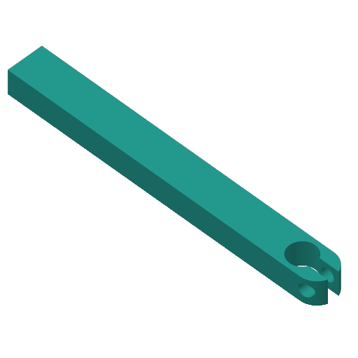
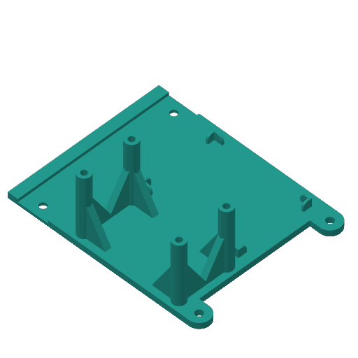
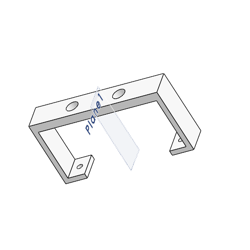
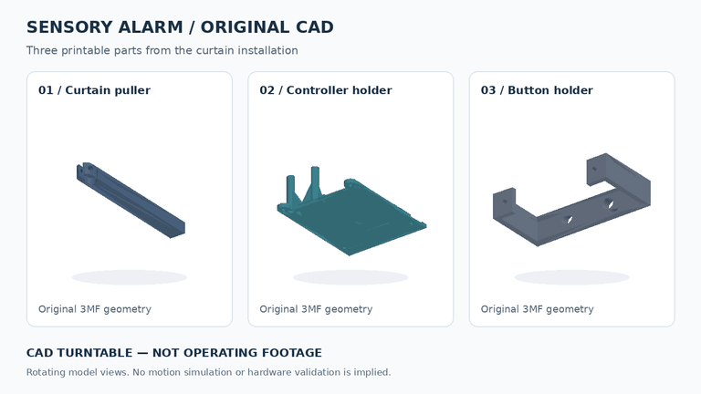

# Printed parts and assembly

The repository contains three original 3MF exports from the curtain build. The previews below were extracted from those files; they show the designs rather than an installed or tested assembly.

| Part | Preview | Download |
| --- | --- | --- |
| Curtain puller |  | [CurtainPuller_v2.3mf](../mechanical%20parts/CurtainPuller_v2.3mf) |
| ESP32, driver and button holder |  | [ESP32-DRV-BTNs_Holder.3mf](../mechanical%20parts/ESP32-DRV-BTNs_Holder.3mf) |
| Button holder |  | [Button_holders.3MF](../mechanical%20parts/Button_holders.3MF) |

## Installation and render

The [installation layout](images/installation-layout.png) uses the owner's controller close-up and curtain-mechanism screenshot as references, with AI-assisted formatting disclosed. It documents the earlier build's appearance rather than the revised firmware's operation.

[Download the CAD turntable video](images/cad-turntable.mp4). This six-second render uses the repository's three original 3MF meshes and assembly transforms. It shows rotating model views rather than a working mechanism or a motion simulation. An operating video is outside the current portfolio scope.

To regenerate the animation, install `numpy==2.3.3`, `Pillow==11.3.0` and `imageio-ffmpeg==0.6.0` in an optional tooling environment, then run `python3 tools/render_cad.py`. These packages are not firmware dependencies.

## Preparing a print

Open a 3MF in your slicer and inspect dimensions, orientation, supports and mounting holes. Two files contain a Bambu Studio export with a Flashforge Adventurer 5M 0.4mm-nozzle profile; choose settings for your own printer instead of treating those saved settings as validated print instructions. The exports contain model geometry and settings, not a prescribed ready-to-run print job.

The public-readiness pass removed Windows source-file paths from the two slicer archives. Their geometry and all other archive entries were preserved. The same metadata removal was applied to local historical copies; geometry and contributor attribution remain.

## Assembly details to record

The original installation was fitted to bedroom curtains. Reproducing that installation requires these physical details, which have not yet been recorded:

- Curtain/rail type, travel distance and load.
- Shaft coupling, fasteners, mounting dimensions and attachment method.
- Filament, orientation, layer height, walls/infill and required supports.
- Placement and actuation of both limit switches.
- Driver ventilation, cable strain relief and access to disconnect motor power.

Verify fit and mechanical clearance before powering the motor. Begin unloaded, check direction, and position both end stops before attaching the curtain load. Complete the [hardware checks](Validation.md) before describing the revised firmware as hardware-validated. Do not infer load-bearing strength from a CAD preview alone.
