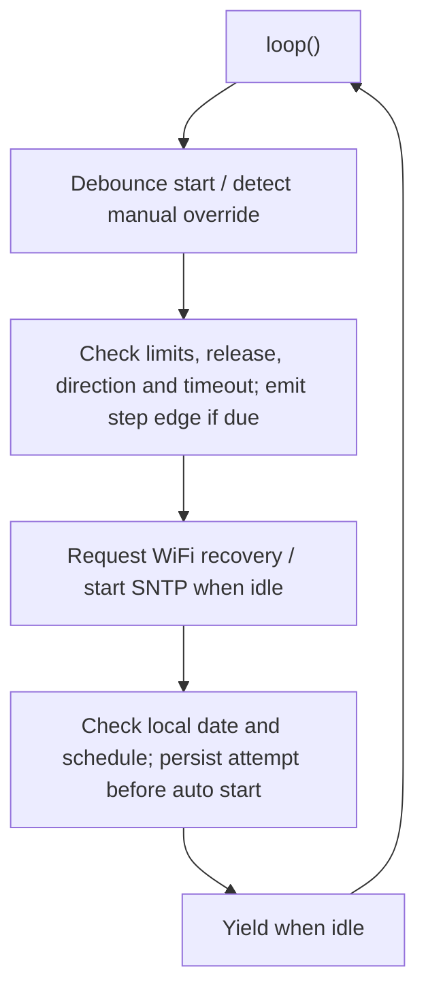

# Improvements brief

Updated 8 October 2026. This brief distinguishes implemented behavior from proposed extensions. See the [entry point](../src/esp32/main.cpp) and [configuration](../src/esp32/config.h), the [wiring reference](Electrical.md), [printable parts](Mechanical.md), and [hardware validation](Validation.md).

## Implemented

The project migrated from Arduino IDE/local folders to PlatformIO and from an Arduino Mega plus ESP32 to an ESP32 alone.

The public-readiness pass adds:

- Focused modules for control, physical input, alarm persistence and network/time recovery.
- Cooperative `micros()`-based stepping with IDLE, OPENING, CLOSING and FAULT states.
- A shared guarded command API and separate motion, limit-derived position, control-source and fault status.
- Hold-to-run manual input with debounced starts and release-to-stop.
- Manual interruption of automatic movement and direction-change stop behavior.
- Latched timeout and contradictory-limit faults.
- Manual operation without WiFi/time, with reconnect requests deferred during travel.
- Bulgarian daylight-saving rules and an alarm evaluated throughout its scheduled minute.
- A persistent daily automatic-attempt date, saved before automatic movement.
- Host regression tests and a CI compile check using placeholder credentials.

Physical acceptance of the revised firmware remains pending. The limit-switch reliability issue mentioned in the earlier roadmap needs confirmation on the real mechanism; source changes and compile checks cannot establish closure.

## Current runtime

No WiFi connection wait or whole-travel motor loop blocks the application. Background SDK work and short flash operations still take time. Network reconfiguration and flash writes are deferred during movement; software pulse timing remains subject to hardware validation.

## Controller state

[Controller API](../src/esp32/curtain_controller.h) exposes `request(direction, source)`, `stop(reason)` and a read-only `status()` snapshot. Internal state and pulse timers are private. Requests return a result: started, busy, fault latched, already at target, manual override, or invalid source. Rejected requests preserve the current movement; contradictory limits latch a fault immediately.

```mermaid
stateDiagram-v2
    [*] --> IDLE
    IDLE --> OPENING: accepted open request
    IDLE --> CLOSING: accepted close request
    OPENING --> IDLE: open limit / stop / manual release or direction change
    CLOSING --> IDLE: closed limit / stop / manual release or direction change
    OPENING --> FAULT: timeout / contradictory limits
    CLOSING --> FAULT: timeout / contradictory limits
    IDLE --> FAULT: contradictory limits
    FAULT --> FAULT: all commands blocked; stop preserves fault
```

Fault recovery requires inspection and device restart; there is no software fault-clear command. A raw button press stops alarm-driven travel. A released button and new debounced press are required to start manual travel after that interruption.

Position is `OPEN` or `CLOSED` only while the corresponding end stop is active, `UNKNOWN` when neither is active, and `CONFLICT` when both are active. There is no encoder, homing sequence or remembered position estimate. Source is `MANUAL` or `ALARM` during travel and `NONE` after stopping. A consumed alarm date records an attempt, never a confirmed position.

All firmware modules remain under `src/esp32/`, covered by the existing PlatformIO source filter. Host tests compile those translation units separately and exercise the actual command API.

## Proposed extensions

| Extension | Status and prerequisite |
| --- | --- |
| Acceleration and hardware-timed stepping | Not implemented. Measure travel and step timing before changing the drive profile. |
| Supported SDK migration | Not implemented. The compile-tested PlatformIO Arduino 2.x environment uses an end-of-life ESP-IDF 4.4.7 baseline; validate a supported stack before maintained network deployment. |
| Editable alarm settings in NVS | Not implemented. Only the last handled alarm date is persisted; the hour/minute remain compiled settings. |
| Local web interface | Not implemented. Route authenticated open/close/stop commands through the same motor/fault logic. |
| OTA firmware updates | Not implemented. Require authenticated updates and a tested recovery strategy. |
| Light sensor, speaker, multiple curtains or voice integration | Ideas only; each needs its own hardware and behavior validation. |

## Web control design boundary

A possible future interface would offer status and authenticated commands on the local network, with a small device-served page. There is no current HTTP server or OTA endpoint.

Authentication and request validation must be part of the first implementation of actuator/configuration writes, rather than a later hardening phase. A local network alone does not establish caller identity. Define how browser requests are protected against unwanted cross-origin commands, how credentials are provisioned, and how a physical override takes priority. Do not expose the device through port forwarding as a shortcut.

Only persist settings when they change. Keep alarm-attempt tracking independent from editable configuration and avoid flash writes in the movement path.

## Next useful evidence

The supplied controller and mechanism screenshots are now surfaced in the README, with AI-assisted formatting disclosed. A CAD turntable video/GIF uses the original 3MF geometry. Filming an operating demo is outside this release scope.

Complete the [commissioning checks](Validation.md) and record the carrier and motor specifications before claiming the revised firmware is hardware-validated. Those checks can remain pending for a clearly documented prototype source release. See the [publication status and remaining checks](Publication.md).
