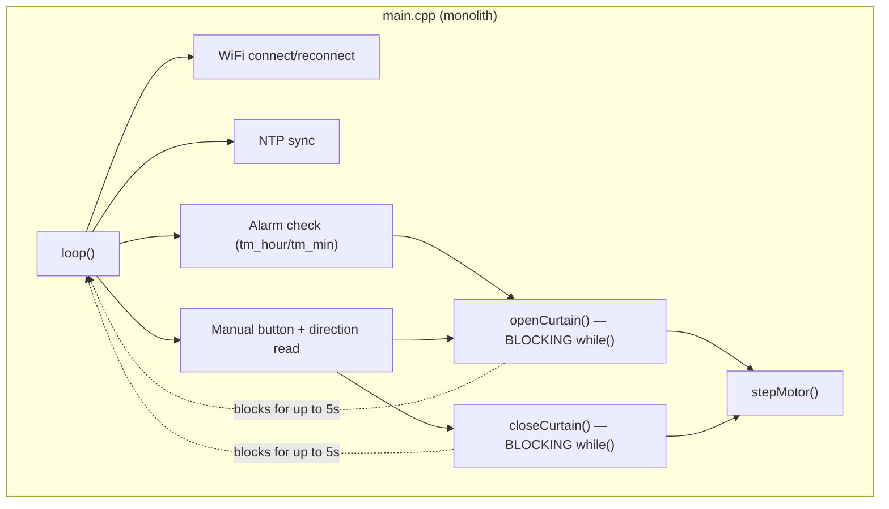
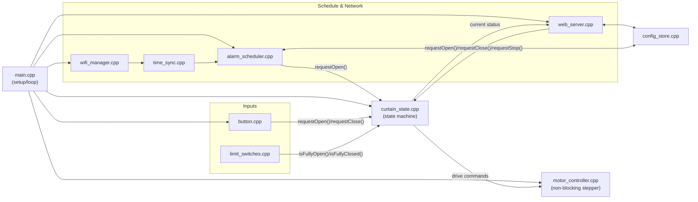
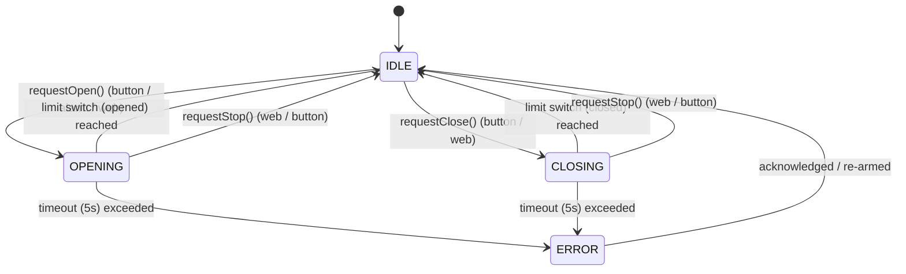
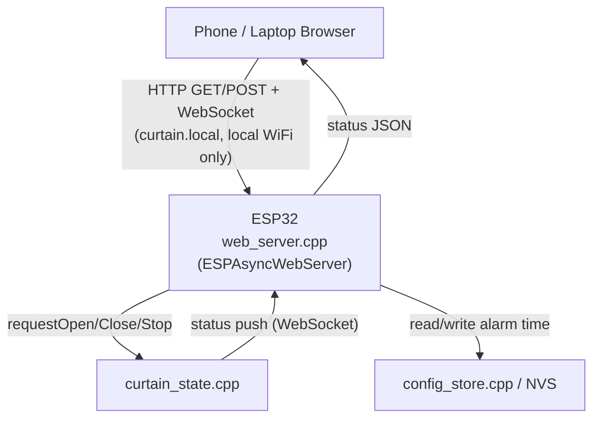
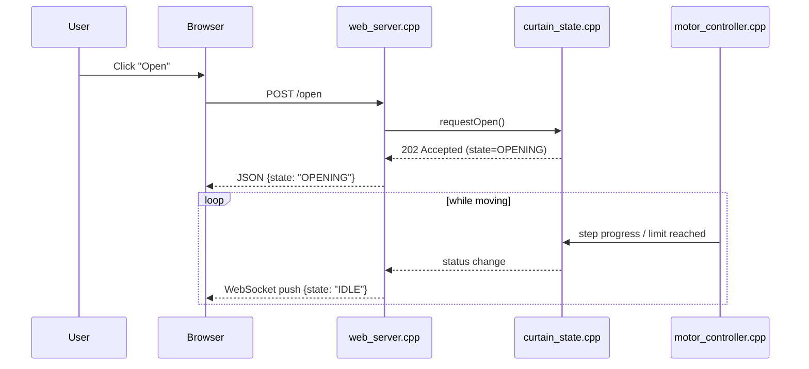

# Improvements Brief — Modular Architecture & Web Control Upgrade

Status: **proposal / planning document only** — no source code has been changed as part of this brief.

Companion docs: [`Electrical.md`](Electrical.md) (wiring source of truth), [`Wiring_diagram.png`](Wiring_diagram.png), [`../README.md`](../README.md).

---

## 1. Purpose & Scope

The current firmware ([`src/esp32/main.cpp`](../src/esp32/main.cpp)) is a single 240-line file that works, but mixes motor control, input handling, WiFi, NTP, and alarm logic together with blocking `while`/`delay()` calls. That's fine for a single-curtain MVP, but it blocks two things the project wants next:

1. **Reliability & maintainability** — one file doing everything makes it harder to isolate bugs (like the recent limit-switch issue) and harder to extend without risking regressions elsewhere.
2. **Web control** — a blocking main loop can't serve HTTP/WebSocket requests responsively while a motor move is in progress; the system needs to be able to do more than one thing "at once."

This brief proposes:
- A modular file structure (behavior-preserving refactor)
- A non-blocking, state-machine-driven runtime
- An architecture for adding local web control on top, without redesigning the hardware layer
- A phased roadmap so each step is independently shippable and testable

---

## 2. Current State (As-Is)

### 2.1 Current Runtime Architecture



While `openCurtain()`/`closeCurtain()` run, nothing else executes — no WiFi reconnect, no serial heartbeat, no ability to respond to a "stop" command from a future web UI.

### 2.2 Current File Structure

```
sensory-alarm-system-build/
├── src/
│   └── esp32/
│       └── main.cpp        # everything: pins, motor, inputs, wifi, time, alarm
├── include/
│   ├── secrets.h            # ignored in git
│   └── secrets.example.h
├── docs/
│   ├── Electrical.md
│   └── Wiring_diagram.png
├── platformio.ini
└── README.md
```

### 2.3 Pain Points

| Issue | Why it matters |
|---|---|
| Single-file monolith | Hard to reason about, hard to test a module in isolation |
| Blocking motor loops | System is unresponsive during every move; no way to add "stop" or web control without a rewrite |
| No state machine | "What is the curtain doing right now?" isn't a queryable value anywhere — it's implicit in which function is currently blocking |
| No persistent config | Alarm time is hardcoded (`alarmHour`/`alarmMinute` constants); every change requires reflashing |
| No transport abstraction | Button and (future) web requests would have to duplicate the same "should we move?" logic if not centralized |
| No web layer | Alarm time changes, manual open/close, and status checks all currently require physical access + Serial monitor |

---

## 3. Proposed Architecture (To-Be)

### 3.1 Design Principles

- **Non-blocking / cooperative**: every module exposes an `update()` called once per `loop()` tick; nothing calls `delay()` beyond microsecond-scale step pulses.
- **Single source of truth for state**: one state machine owns "what is the curtain doing," everything else (button, alarm, web) only *requests* transitions.
- **Transport-agnostic core**: the motor/state layer doesn't know whether a command came from a physical button, a schedule, or an HTTP request — they all funnel through the same request API. This is what makes adding web control additive rather than a rewrite.
- **Hardware details stay isolated**: pin numbers and wiring assumptions live in one config header, matching [`Electrical.md`](Electrical.md) as the source of truth.

### 3.2 Proposed Modular File Structure

```
src/
├── main.cpp                     # setup()/loop() orchestration only — no logic
├── config/
│   ├── pins.h                    # pin defs — mirrors Electrical.md
│   └── settings.h                # timeouts, step delay, defaults
├── motor/
│   ├── motor_controller.h/.cpp   # non-blocking stepper driving, millis()-based
├── inputs/
│   ├── button.h/.cpp             # debounced manual button + direction switch
│   └── limit_switches.h/.cpp     # open/closed switch reads + diagnostics
├── state/
│   └── curtain_state.h/.cpp      # the state machine (IDLE/OPENING/CLOSING/ERROR)
├── network/
│   ├── wifi_manager.h/.cpp       # connect/reconnect, non-blocking
│   ├── time_sync.h/.cpp          # NTP sync
│   └── web_server.h/.cpp         # NEW — HTTP/WebSocket control API
├── alarm/
│   └── alarm_scheduler.h/.cpp    # daily trigger logic, reset-at-midnight
└── storage/
    └── config_store.h/.cpp       # NEW — persisted alarm time & settings (NVS)
```

Each `inputs/`, `network/`, and `alarm/` module only *calls* `curtain_state` to request `OPEN` / `CLOSE` / `STOP` — none of them talk to the motor directly. This is the seam that makes web control safe to bolt on later.

### 3.3 Module Dependency Diagram



### 3.4 Non-Blocking State Machine



`motor_controller.update()` is called every `loop()` tick and only issues a single step pulse if enough time has passed since the last one (`micros()`-based), instead of spinning in a blocking `while`. This is what lets `web_server.update()` and `wifi_manager.update()` keep running *during* a curtain move.

### 3.5 Non-Blocking Main Loop (Sequence)

```mermaid
sequenceDiagram
    participant Loop as loop()
    participant WiFi as wifi_manager
    participant Web as web_server
    participant Btn as button/limit_switches
    participant Alarm as alarm_scheduler
    participant State as curtain_state
    participant Motor as motor_controller

    loop every tick (no delay())
        Loop->>WiFi: update()
        Loop->>Web: update() (handle pending HTTP/WS requests)
        Loop->>Btn: update() (debounce, read switches)
        Loop->>Alarm: update() (check schedule)
        Loop->>State: update() (evaluate requests + limits)
        State->>Motor: setTarget(OPEN/CLOSE/STOP)
        Loop->>Motor: update() (emit one step if due)
    end
```

---

## 4. Future Feature: Web Control

### 4.1 Goals

- Open/close the curtain from a phone or laptop on the same WiFi network
- View live status (idle/opening/closing/error, last alarm trigger, WiFi/NTP health)
- Change the alarm time without reflashing
- (Later) OTA firmware updates from the same interface

### 4.2 Proposed Web Architecture



Served over the local network only (no port-forwarding/cloud relay in scope for v1) — mDNS (`curtain.local`) avoids needing to know the ESP32's IP.

### 4.3 Example API Surface

| Method | Path | Purpose |
|---|---|---|
| `GET` | `/status` | Current state, last alarm fired, WiFi/NTP health |
| `POST` | `/open` | Request open (same as physical button) |
| `POST` | `/close` | Request close |
| `POST` | `/stop` | Interrupt current move |
| `GET`/`POST` | `/alarm` | Read/update alarm hour+minute (persisted via `config_store`) |
| `GET` | `/` | Minimal HTML/JS control page (served from LittleFS) |
| `WS` | `/ws` | Live status push, so the page updates without polling |

### 4.4 Web Command Sequence



---

## 5. Phased Roadmap

| Phase | Scope | Behavior change? | Risk |
|---|---|---|---|
| **0 — done** | PlatformIO migration, ESP32-only, basic safety, timeout diagnostics | — | — |
| **1 — Modularize** | Split `main.cpp` into the `config/`, `motor/`, `inputs/`, `network/`, `alarm/` modules above, same blocking behavior preserved | No — pure refactor | Low, but must be verified against [`Electrical.md`](Electrical.md) pin assumptions before/after |
| **2 — Non-blocking core** | Replace blocking `while`/`delay()` with `curtain_state` + `micros()`-based stepping | Yes — internal only, external behavior equivalent | Medium — timing-sensitive, bench-test unloaded first |
| **3 — Persistent config** | `config_store.cpp` (NVS/Preferences) for alarm time & settings | Yes — additive | Low |
| **4 — Web control** | `web_server.cpp`, local HTML/JS page, `/status`, `/open`, `/close`, `/stop`, `/alarm` | Yes — additive | Medium — new attack surface on local network, see §6 |
| **5 — OTA + hardening** | ArduinoOTA or web-based OTA upload, basic token auth on write endpoints | Yes — additive | Medium — needs auth before exposing write endpoints |
| **6 — Future ideas** (from README) | Multi-curtain, light sensor, speaker/voice integration | Yes — additive | Depends on feature |

Each phase is independently flashable and testable — Phase 1 in particular should produce **zero behavior change**, so it can be verified with the exact same manual test checklist used before the refactor.

---

## 6. Risks & Mitigations

| Risk | Mitigation |
|---|---|
| Phase 1 refactor accidentally changes pin/logic behavior | Diff against [`Electrical.md`](Electrical.md) assumptions; re-run the full manual open/close/alarm/limit-switch test checklist before merging |
| Non-blocking stepping (Phase 2) introduces missed-step or timing bugs | Bench-test with motor unloaded and 9V supply disconnected first, exactly as already documented in the README's "Before powering the motor" checklist |
| Web control (Phase 4) exposes an unauthenticated actuator on the network | Keep it local-network-only (no port forwarding) for v1; add a simple shared-secret token (stored alongside WiFi creds in `secrets.h`, same pattern already in use) before exposing `/open`/`/close`/`/stop` |
| Frequent config writes wear out NVS flash | Only write `config_store` on actual change (e.g., alarm time edited), never on a timer |
| Scope creep — trying to do modularize + non-blocking + web in one PR | Treat each roadmap phase as its own branch/PR, per the table above |

---

## 7. Immediate Next Steps

1. Confirm the current physical build (limit switch fix) is stable under the existing blocking architecture — don't refactor on top of an unverified hardware fault.
2. Review/approve this roadmap and pick a starting phase (recommend **Phase 1: Modularize**, since it's behavior-preserving and lowest risk).
3. Open Phase 1 as its own branch; re-run the manual test checklist from the README before merging.
4. Only after Phase 1 is verified, proceed to Phase 2 (non-blocking core), which is the real prerequisite for Phase 4 (web control).

### Open Questions

- **Auth model for web control**: none (trust local network), shared token, or a lightweight login? (Affects Phase 4/5 scope.)
- **Config storage**: ESP32 `Preferences` (NVS key/value) vs. a JSON file on LittleFS? (NVS is simpler for a handful of scalar settings; LittleFS scales better if config grows.)
- **Web UI**: minimal single served HTML/JS page (no build step) vs. a small separate frontend project? Recommend starting with the former to keep the embedded repo self-contained.
