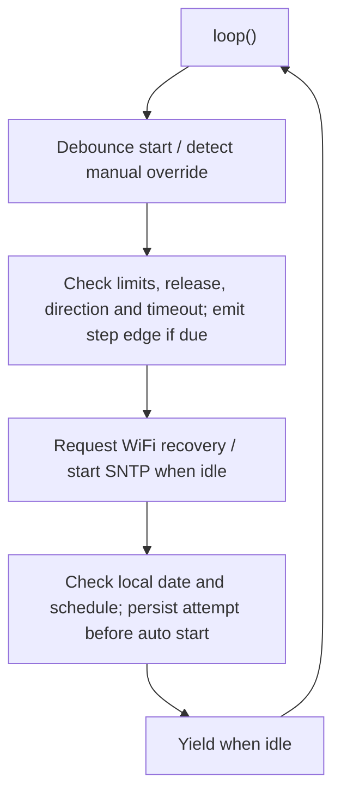

# Improvements brief

Updated 8 October 2026. This brief distinguishes implemented behavior from proposed extensions. See [main.cpp](../src/esp32/main.cpp), the [wiring reference](Electrical.md), [printable parts](Mechanical.md), and [hardware validation](Validation.md).

## Implemented

The project migrated from Arduino IDE/local folders to PlatformIO and from an Arduino Mega plus ESP32 to an ESP32 alone.

The public-readiness pass keeps the small single-file structure while adding:

- Cooperative `micros()`-based stepping with IDLE, OPENING, CLOSING and FAULT states.
- Hold-to-run manual input with debounced starts and release-to-stop.
- Manual interruption of automatic movement and direction-change stop behavior.
- Latched timeout and contradictory-limit faults.
- Manual operation without WiFi/time, with reconnect requests deferred during travel.
- Bulgarian daylight-saving rules and an alarm evaluated throughout its scheduled minute.
- A persistent daily automatic-attempt date, saved before automatic movement.
- Host regression tests and a CI compile check using placeholder credentials.

Physical acceptance of the revised firmware remains pending. The limit-switch reliability issue mentioned in the earlier roadmap needs confirmation on the real mechanism; source changes and compile checks cannot establish closure.

## Current runtime

No WiFi connection wait or whole-travel motor loop blocks the application. Background SDK work and short flash operations still take time. Network reconfiguration and flash writes are deferred during movement; software pulse timing remains subject to hardware validation.

## Proposed extensions

| Extension | Status and prerequisite |
| --- | --- |
| Acceleration and hardware-timed stepping | Not implemented. Measure travel and step timing before changing the drive profile. |
| Supported SDK migration | Not implemented. The compile-tested PlatformIO Arduino 2.x environment uses an end-of-life ESP-IDF 4.4.7 baseline; validate a supported stack before maintained network deployment. |
| Editable alarm settings in NVS | Not implemented. Only the last handled alarm date is persisted; the hour/minute remain compiled settings. |
| Module split | Optional as complexity grows. If files move outside `src/esp32/`, update `build_src_filter` accordingly. |
| Local web interface | Not implemented. Route authenticated open/close/stop commands through the same motor/fault logic. |
| OTA firmware updates | Not implemented. Require authenticated updates and a tested recovery strategy. |
| Light sensor, speaker, multiple curtains or voice integration | Ideas only; each needs its own hardware and behavior validation. |

## Web control design boundary

A possible future interface would offer status and authenticated commands on the local network, with a small device-served page. There is no current HTTP server or OTA endpoint.

Authentication and request validation must be part of the first implementation of actuator/configuration writes, rather than a later hardening phase. A local network alone does not establish caller identity. Define how browser requests are protected against unwanted cross-origin commands, how credentials are provisioned, and how a physical override takes priority. Do not expose the device through port forwarding as a shortcut.

Only persist settings when they change. Keep alarm-attempt tracking independent from editable configuration and avoid flash writes in the movement path.

## Next useful evidence

Complete the [commissioning checks](Validation.md), record the carrier and motor specifications, and add real installation photographs and a demo. These would make the existing prototype easier to evaluate before extending its feature set.
