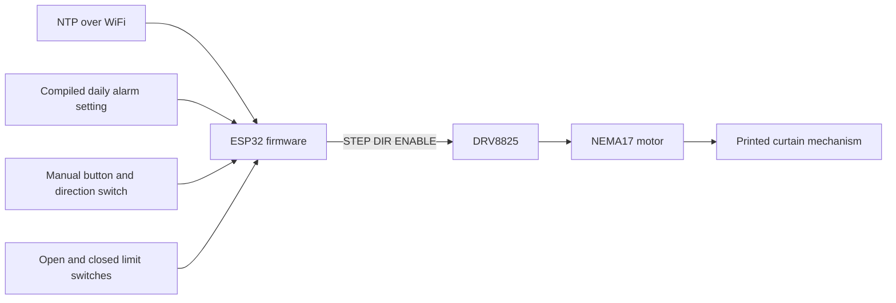

# Sensory Alarm System Public Readiness Review

Baseline reviewed on 8 October 2026 at commit `cc3a14f`. Scope: the local checkout, all 17 commits reachable through local branches and remote-tracking refs, documentation, firmware, image metadata, and printable CAD archives.

**Baseline verdict: a credible personal hardware prototype, but not yet a polished portfolio reference.** The ESP32 firmware, printable parts, and history of simplifying a working Arduino/ESP32 build demonstrate useful engineering work. The main gaps are hidden privacy metadata, incorrect wiring guidance, several control-flow defects, and a README that makes the physical result difficult to see. No real credentials, API tokens, or private keys were found within the inspected scope.

The baseline findings below describe the original commit. Links to the original files use that commit so their line references remain meaningful. The original findings are retained for context. Current implementation, privacy cleanup and publication boundaries are summarized next; baseline links now point to the sanitized equivalent commits.

## Status after implementation and privacy cleanup

**Current verdict: suitable for a public portfolio as a documented legacy hardware prototype once the sanitized branch and final presentation changes are published.** The owner has authorized historical metadata removal and excluded filming an operating demo from scope. Contributor credit remains. The revised firmware is compile-tested; physical acceptance remains pending and is disclosed.

| Area | Current result |
| --- | --- |
| Firmware behavior | Focused controller/input/alarm/network modules; hold-to-run input; explicit motion, position, command source and latched fault status; shared guarded requests. |
| Regression and build checks | 22 host scenarios pass; ESP32 release build uses 45,084 bytes RAM (13.8%) and 751,825 bytes flash (57.4%), with placeholder credentials. |
| Wiring | Professional logical illustration restored prominently, backed by corrected connection tables and an editable SVG. Exact hardware pinout and bench acceptance remain unverified. |
| Historical privacy | Verified sanitized copy preserves all 19 commits, contributor names, dates, messages, code and geometry; replaces 30 personal email fields and clears two historical CAD source paths. Installed locally; discarded local objects and old reflog identities purged. GitHub update remains pending. |
| Current CAD files | Private source paths cleared; every non-metadata archive entry is preserved. |
| Installation presentation | Screenshot 1 selected as the lead controller view and screenshot 2 as mechanism context. The stored photo-based contact sheet discloses AI-assisted processing; screenshots 3 and 4 omitted as darker duplicates. |
| Animation | Six-second MP4 and inline GIF render actual 3MF geometry. Explicitly labeled CAD views, not operating footage. A real working video is outside scope. |
| Original attribution | Contributor names and MIT license retained. The metadata cleanup changes commit IDs, not the project's chronology or credited contribution. |
| SDK boundary | Current pinned stack remains an explicit legacy baseline; supported SDK migration is future maintenance before claiming maintained network-connected firmware. |
| GitHub publication | Local rewrite does not update GitHub. Guarded main-only force push, hosted CI check, server-reference review and visibility review remain manual publication steps. |

A deferred skipped-alarm date can be lost if power fails before the idle flash write. Automatic movement requires persistence first. A saved date far in the future suppresses subsequent earlier dates. These limitations remain described in [Validation.md](Validation.md).

The dependency baseline uses Arduino core 2.0.17 and ESP-IDF 4.4.7. The 4.4 branch [reached end of life in July 2024](https://github.com/espressif/esp-idf/releases/tag/v4.4.8). Pinning establishes reproducibility, not current vendor security coverage; exhaustive dependency CVE applicability has not been assessed.

Earlier scans with `detect-secrets` 1.5.0 found no credential candidates in the checkout and reachable historical file contents, including decompressed CAD text. The new sanitized history has also been structurally checked across every commit and archive revision. Its final checkout tree is byte-identical to the pre-cleanup tip; only historical CAD metadata and commit email fields differ. The final local scan covered 19 reachable commits, 70 file blobs, all three unique CAD archive versions and 21 decompressed archive text entries. It found zero personal commit email fields, private source paths, personal text emails, or credential candidates in checkout/history. Old local commit objects and reflog identities were purged. These results cover the local checkout and refs; GitHub caches, forks and other clones remain outside this local cleanup.

See [Publication.md](Publication.md) for the concrete action list, guarded push command, selected media and remaining maintenance boundaries. Publication as prototype source does not require filming or a supported-SDK migration first; accurate scope disclosure does.

## Original review

## Readiness by area at baseline

| Area | Assessment | Main finding |
| --- | --- | --- |
| Code clarity | Reasonable for a small prototype | A readable 243-line file with named constants and helpers; behavioral defects matter more than splitting it into modules. |
| Documentation accuracy | Needs correction | The documented timeout is stale, and the supposedly authoritative wiring text contains a driver pin error. |
| Portfolio presentation | Needs work | No real build photo, demo, or inline architecture diagram in the root README; printable parts are absent from its project tree. |
| Secrets and privacy | No confirmed secrets; privacy decisions remain | A personal email appears in commit metadata, and two CAD archives retain a Windows user path. |
| Reproducibility and validation | Unverified in this review | PlatformIO is unpinned; there are no executable tests or CI, and the required build toolchain is unavailable here. |

## Findings to resolve before presenting the build as reliable

Priority reflects impact on users and public presentation, rather than a formal vulnerability score. Firmware findings below come from source inspection and require bench confirmation.

### High priority Wiring references are unreliable

[Electrical.md](https://github.com/ShuraStoilov98/sensory-alarm-system-build/blob/cc3a14f/docs/Electrical.md), lines 176–185, instructs readers to connect DRV8825 `VDD` to ESP32 `3V3`. Standard DRV8825 carriers have an internal regulator and no external `VDD` logic supply; the corresponding A4988 carrier position is `FAULT` on a DRV8825. Some protected carriers tolerate a logic supply there, but that does not make the pin `VDD` or establish what this particular board supports. The physical carrier model and revision are not identified. See the manufacturer's [DRV8825 carrier documentation](https://www.pololu.com/product/2133/).

The [wiring image](https://github.com/ShuraStoilov98/sensory-alarm-system-build/blob/cc3a14f/docs/Wiring_diagram.png) also has visible discrepancies: the traced control wires do not consistently match the GPIO summary; RESET/SLEEP connections are not clearly shown; and the motor PSU positive connection is not clearly traced to VMOT. It labels itself accurate, while the text describes it as AI-generated and potentially inaccurate. The text cannot safely serve as its corrective source until the text is fixed too.

Correct both references against the actual board and its schematic before promoting either as a reproduction guide. Identify the carrier and motor part numbers, measured current-limit setting, coil pairs, PSU, and assembly orientation. The existing common-ground, bulk-capacitor, and powered-rewiring precautions are useful and should stay.

### High priority Manual control is disabled after the alarm

[main.cpp](https://github.com/ShuraStoilov98/sensory-alarm-system-build/blob/cc3a14f/src/esp32/main.cpp), lines 202 and 225–234: the manual-control condition includes `!alarmTriggeredToday`, and the alarm sets that flag to `true`. After a normal morning opening, pressing the button to close the curtains does nothing for the rest of the day, until the flag is reset or the controller restarts.

The daily flag should govern automatic scheduling without gating manual operation. Verify manual closing immediately after an automatic opening.

### High priority Missing time prevents manual control and application recovery

[main.cpp](https://github.com/ShuraStoilov98/sensory-alarm-system-build/blob/cc3a14f/src/esp32/main.cpp), lines 179–190: when `getLocalTime()` fails, `loop()` returns before checking the button, reconnecting WiFi, or running the application's time-sync retry. A cold power-on with unavailable WiFi or NTP can therefore leave the device unusable manually. If the initial WiFi connection fails, `syncTime()` skips NTP initialization as well.

WiFi background behavior may eventually recover connectivity, but the application's own reconnect and sync logic is unreachable while time remains invalid. Keep button handling and recovery running independently of valid wall-clock time; only the automatic alarm requires it. Test a cold boot with WiFi unavailable, then restore the access point and verify recovery without resetting the ESP32.

### High priority Timeout does not latch a motor fault

[main.cpp](https://github.com/ShuraStoilov98/sensory-alarm-system-build/blob/cc3a14f/src/esp32/main.cpp), lines 77–89, 100–112, and 201–214: a timeout stops and disables the driver, but records no persistent fault state. With an inactive or failed destination switch and a held run button, another movement attempt can start on the next eligible loop. The five-second limit bounds each attempt, rather than the total run while a fault persists.

Releasing the button also does not stop a movement already in progress; the motor loops check only the destination switch and elapsed time. A disconnected limit-switch wire reads HIGH through the pull-up and is indistinguishable from normal travel. These are actuator safety limitations, not confirmed remote exploits. Define fault acknowledgement and stop behavior, and document that end stops currently depend on software polling. Replace blanket claims that the device is safe with the specific protections and limitations.

### Medium priority Alarm timing has several edge cases

| Finding | Evidence | Consequence |
| --- | --- | --- |
| Fixed summer offset | `main.cpp`, lines 23–24 | UTC+3 with no DST adjustment cannot represent both Bulgarian winter and summer time. Use timezone rules; Espressif documents [timezone and daylight-saving handling](https://docs.espressif.com/projects/esp-idf/en/stable/esp32/api-reference/system/system_time.html#timezones). |
| Narrow trigger window | Lines 218–223; blocking operations at 70–125 | The first five seconds of the alarm minute can be missed while another operation blocks the loop. The README claim that this prevents missed alarms is too strong. |
| First-loop daily reset occurs after alarm evaluation | Lines 225–234 | If the first successful loop after boot fires the alarm, `lastDay == -1` then clears the newly set flag. A second attempt is possible if the open limit remains inactive and another loop still falls inside the window. |
| Alarm state lives only in RAM | Line 33 | A restart forgets whether the alarm already fired. A timeout is also recorded as an alarm trigger without distinguishing successful opening from failure. |

Reset or establish the current date before evaluating the alarm, and distinguish a scheduling attempt from a successful movement. A date-based trigger record and a defined missed-alarm policy would make the intended behavior clearer.

### Medium priority README claims exceed the implementation

[README.md](https://github.com/ShuraStoilov98/sensory-alarm-system-build/blob/cc3a14f/README.md), line 78, says the motor timeout is 15 seconds; [main.cpp](https://github.com/ShuraStoilov98/sensory-alarm-system-build/blob/cc3a14f/src/esp32/main.cpp), line 37, sets 5 seconds. The July commit `8af64f3` reduced it without updating that passage.

The claimed debouncing is actually a 300 ms interval between accepted checks. There is no stable-input debounce or press/release edge tracking, and a held button can request repeated runs. The comments claiming direction is sampled once per press overstate what this logic does.

The README's April update date is stale relative to July changes. Its closing promise of production-grade design is also unsupported: a non-blocking refactor alone would not resolve wiring, fault handling, validation, or security of future features. Describe the current prototype and distinguish implemented behavior from planned work.

## Secrets and personal data sweep

The scan covered all 28 unique reachable Git file blobs, the 16 original working-tree files, author and committer metadata, all three `.3mf` archives after decompression, and PNG text/provenance metadata. It included historical firmware removed from the current tree. The clone is not shallow, and `git fsck --full --no-reflogs --unreachable` reported no unreachable objects.

Pattern checks covered WiFi and password assignments, quoted JSON secret fields, private keys, common cloud/service tokens, credential-bearing URLs, JWTs, email addresses, and local filesystem paths. Credential candidates in source and README were placeholders or references to the secrets macros. This was a custom scan plus manual inspection; Gitleaks and TruffleHog are not installed, so this is not a scanner certification or a guarantee against every possible encoded secret.

| Finding | Location | Public-readiness implication |
| --- | --- | --- |
| No real WiFi credentials or API/private keys found | Current and historical source and documents | `include/secrets.example.h` contains placeholders. `include/secrets.h` is not present locally, was not found in reachable history, and `git check-ignore` confirms the exclusion. |
| Personal email retained in Git metadata | Author/committer fields across 17 commits | One personal email appears in 26 author/committer field occurrences; eight other occurrences use GitHub's noreply address. The address is intentionally not repeated here. Decide whether this public attribution is acceptable. Setting a noreply address now affects future commits only. |
| Windows username and OneDrive desktop path retained in CAD | `CurtainPuller_v2.3mf` and `ESP32-DRV-BTNs_Holder.3mf`, inside `Metadata/model_settings.config`, `source_file`, line 9 | Re-export or remove the source-path metadata if unwanted. The path also exists in historical copies introduced by the May CAD commits. Replacing the current files does not erase those copies. |
| Named collaborator and personal project context | README background; author name in LICENSE and history | These are attribution and personal context, rather than credentials. Keep accurate contribution credit and confirm the named collaborator is comfortable with it being public. |
| Slicer settings exposed | Two CAD archives | Printer model/profile and host type are present; no printer credentials were found. No equivalent user-path exposure was detected in `Button_holders.3MF`. |
| Image provenance identifies AI generation | `Wiring_diagram.png`, `caBX` metadata | OpenAI/C2PA provenance corroborates the existing disclosure. Public signing certificates in the provenance are not private keys. Do not represent this particular diagram as an original hand-drawn build artifact. |

There is no confirmed credential leak that warrants rotation from these results. Privacy metadata may be accepted or removed according to the owner's preference. A history rewrite would change commit identities and require coordination; none was attempted. Preserving the original build history is valuable, so do not rewrite it merely for cosmetic reasons.

### Software security exposure at baseline

The firmware connects to WiFi and configures NTP. No HTTP server, web command API, OTA handler, or cloud-control service is implemented in the inspected source. The web architecture in the improvements brief is proposed, not an existing exposed endpoint.

WiFi credentials referenced as string constants will be included in firmware compiled with real secrets. Existing `.bin` and `.elf` ignore rules help prevent accidental commits, but any future downloadable firmware or CI artifact must use placeholders rather than personal credentials.

`platform = espressif32` has no version pin. No installed dependency tree or lock information establishes the actual Arduino/ESP-IDF versions used to validate the board, so dependency CVE applicability remains unassessed. Pin a version after a successful build and record the resolved framework/toolchain versions. PlatformIO explicitly recommends [pinning the development platform for repeatable builds](https://docs.platformio.org/en/latest/projectconf/sections/env/options/platform/platform.html).

For the proposed web-control feature, authentication must arrive with actuator and configuration write endpoints, rather than a later hardening phase. A local network alone does not authenticate callers. The brief already recognizes this concern, but its phase ordering and open question about no authentication are inconsistent with that safeguard.

## Code and documentation quality

The strongest choices are a small source footprint, named GPIO/time constants, symmetric open/close helpers, separate ignored credentials, rollover-aware unsigned elapsed-time comparisons, and explicit driver disable after movement. PlatformIO migration and removal of inter-controller communication are concrete engineering decisions worth explaining.

A single 243-line firmware file is acceptable at this size. A large module split is optional for public release. More valuable small changes would fix the control-flow defects, represent movement outcomes explicitly, and keep comments aligned with behavior. Minor formatting inconsistencies, duplicate movement logic, and mutable configuration globals are polish issues rather than publication blockers.

The root README is 321 lines and repeats status, next steps, future ideas, and the next session. Its opening has spelling and grammar errors. The long electrical reference is useful but uses repeated top-level headings and generic carrier/motor assumptions. `include/README`, `lib/README`, and `test/README` are generated PlatformIO explanations; `test/README` is not evidence of project tests.

All 11 existing relative Markdown links resolve locally. Discoverability is the problem: the only README link to the wiring image appears near the bottom, and there are no direct README links to the electrical document, improvements brief, or CAD files. The six Mermaid diagrams in the improvements brief are buried there and mostly describe proposed architecture.

## README presentation for a portfolio reviewer

The first screen should show what was built and why it demonstrates the ability to finish a physical project. Keep the Christmas 2024 build story, contributor credit, and subsequent solo improvements, with an explicit distinction between the original build and later documentation. The current checkout has printable models but no real assembly photograph or working demo.

Recommended reading order:

1. A short description of curtains opening as a morning alarm, followed by a real installation photo and a short video or GIF of the mechanism working. Show manual control and the physical end-stop behavior too. Obtain these from the actual build; synthetic renders would not prove operation.
2. A compact explanation of personal contribution, original collaborative work, and the simplification from two controllers to one ESP32. Add measured results only after verifying them, such as travel time or repeated successful runs.
3. A small architecture diagram showing the implemented system, with prominent links to verified wiring, printable parts, and the demo.
4. The existing secrets/build/flash instructions, followed by a bill of materials, mechanical assembly/printing notes, and the tested configuration.
5. Honest current limitations and a link to the existing improvements brief, moving repeated future material out of the landing page.

The following diagram describes the present design at a functional level. It is suitable for GitHub's Mermaid rendering and deliberately does not serve as an electrical wiring reference:

## Unfinished improvements already in the repository

[improvements_brief.md](https://github.com/ShuraStoilov98/sensory-alarm-system-build/blob/cc3a14f/docs/improvements_brief.md) explicitly labels itself a proposal. The local refs contain only `main` and `origin/main`; no local feature branches or tags demonstrate a partially implemented upgrade.

| Improvement | Current evidence |
| --- | --- |
| ESP32-only migration and PlatformIO setup | Implemented in source/configuration. Historical Arduino Mega code remains in Git history. |
| Limit-switch reliability | Timeout diagnostics exist; the brief still asks for physical confirmation of the recent limit-switch fix. No recorded acceptance results establish closure. |
| Non-blocking stepping and state machine | Not implemented; movement uses blocking loops and the main loop ends with a one-second delay. |
| Modular architecture | Proposed only. Moving files would also require adjusting `build_src_filter = +<esp32/>` to include the proposed locations. |
| Persistent alarm settings | Not implemented; 06:30 is compiled into the source. |
| Acceleration, web control, OTA, light/speaker/voice features | Roadmap items, with no supporting implementation in this checkout. |
| Safety and long-run validation | README testing items remain unchecked; there is no executable test suite or bench-results document. |

The brief says motor timing is `millis()`-based in its proposed file tree but describes `micros()` elsewhere. It also refers to a full manual test checklist that the README does not actually contain. Clarify these before treating the proposal as an implementation reference. For this portfolio goal, new web/OTA features are optional; accurate documentation and evidence of a working mechanism provide a more immediate benefit.

## Verification and release boundary at baseline

Completed checks: source and documentation inspection, reachable-history scanning, decompressed CAD metadata inspection, visual review of the wiring image, PNG provenance inspection, ignore-rule verification, Git object integrity checking, and local Markdown link checks. Manufacturer references were used to verify the driver documentation issue.

PlatformIO, a C++ compiler, and dedicated secret scanners are unavailable in this environment. No firmware compilation, static-analysis tool run, hardware test, or runtime reproduction was performed. GitHub visibility, server-side branches, issues, pull requests, Actions artifacts, and releases were not verified; the GitHub page could not be retrieved. The conclusions apply to the reviewed local refs, not every possible copy or external artifact.

Before highlighting this as a reliable working build, resolve or explicitly disclose the control defects; correct the driver references; settle the privacy metadata choices; and record a successful build plus physical checks of cold boot without WiFi, reconnect, manual movement after the alarm, both end stops, timeout/re-arm behavior, and alarm timing across date changes. A real photo and demo should then lead the README. The original project structure and build history can remain intact.
